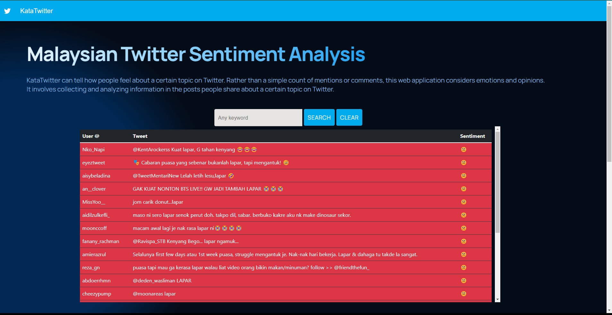

# Twitter Sentiment Analysis Web Application

A real time web application that visualizes sentiment analysis of tweets for the Malaysian language.

## Built with

- [React js](https://reactjs.org/)
    - [Material-ui](https://mui.com/)
    - [Bootsrap](https://react-bootstrap.github.io/)
- [Spring Boot](https://spring.io/projects/spring-boot)
    - [MySQL](https://spring.io/guides/gs/accessing-data-mysql/)
    - [Twitter4j](https://twitter4j.org/en/index.html)
- [Maven](https://maven.apache.org/)
- [Deeplearning4J (CUDA 11.2)](https://deeplearning4j.konduit.ai/multi-project/explanation/configuration/backends/cudnn)

## Prerequisites

- [JAVA 8](https://www.oracle.com/java/technologies/java8.html)
- [npm (yarn)](https://www.npmjs.com/package/yarn)

- Datasets, vector model, cnn/rnn models and stopwords file. [link](https://drive.google.com/drive/folders/1NgGRI2Hv6fmc2kRz35R5ej0L3QNDlIkT?usp=sharing)

## Screenshots

## Contact
[Danny Rashid](https://www.linkedin.com/in/dannyrashd/)

[danny.rashd@gmail.com](mailto:dannyrashd@gmail.com)
