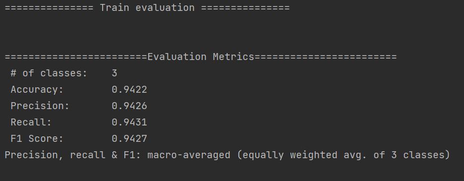
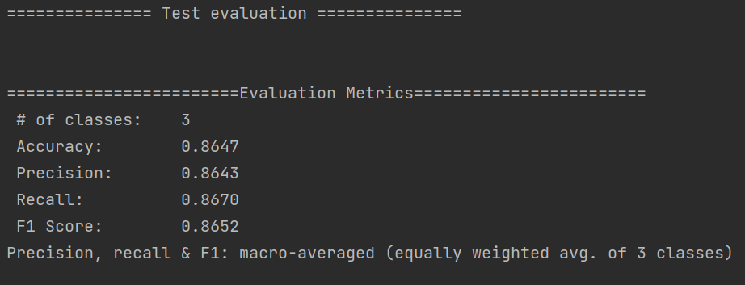
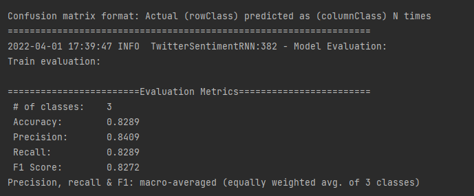
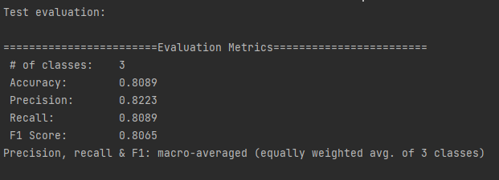
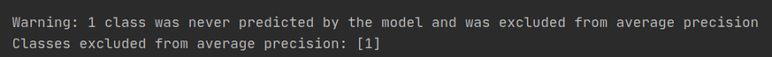

# Twitter Sentiment Analysis

The aim of this project is to build a real-time web application that visualizes sentiment analysis of tweets for the Malaysian language.

# Word2Vec

Word2vec is a two-layer neural net that processes text. Its input is a text corpus and its output is a set of vectors: feature vectors for words in that corpus. The output of the Word2vec neural net is a vocabulary in which each item has a vector attached to it, which can be fed into a deep-learning net or simply queried to detect relationships between words.

| Parameter           | Value       |
| :--------           | :---------- |
| `Min word frequency`| 5           |
| `Epoch`             | 1           |
| `Layer size`        | 300         |
| `Window size`       | 5           |

## Sentiment Analysis with Neural Networks

### CNN

| Parameter                  | Value              |
| :--------                  | :----------        |
| `batchSize`                | 64                 |
| `vectorSize`               | 300                |
| `nEpochs`                  | 3                  |
| `Weight Init`              | RELU               |
| `Activation`               | LEAKY RELU         |
| `Optimizer`                |  Adam              |
| `Learning Rate`            |  0.001             |
| `L2`                       | 0.0001             |
| `Conv. Layer 1 Kernel size`|  3                 |
| `Conv. Layer 2 Kernel size`|  4                 |
| `Conv. Layer 3 Kernel size`|  5                 | 
| `Pooling type`             | Global Pooling     |
| `Loss function `           | Multiclass entropy |
| `Output activation`        | Softmax            |
| `CNN Output`               |  3                 |

***Results for the TRAINING evaluation:***

***Results for the TESTING evaluation:***

### RNN

| Parameter              | Value              |
| :--------              | :----------        |
| `batchSize`            | 64                 |
| `vectorSize`           | 300                |
| `nEpochs`              | 3                  |
| `Optimizer`            |  Adam              |
| `Learning Rate`        | 0.001              |
| `L2`                   | 0.0001             |
| `LSTM 1 Output`        |  300               |
| `LSTM 2 Output`        |  150               | 
| `LSTM 3 Output`        |  75                |
| `LSTM 1,2,3 Activation`|  tanH              |
| `Loss function `       | Multiclass entropy |
| `Output activation`    | Softmax            |
| `RNN Output`           |  3                 |

***Results for the TRAINING evaluation:***

***Results for the TESTING evaluation:***

## Model Evaluation

The output of the model evaluation are Accuracy, Precision, Recall, F1 Score and confusion matrix. F1 score is the preferred metric in which it takes false positives and false negatives since it is a weighted average of Precision and Recall. Accuracy are reliable metric when it comes to evaluating a balanced distribution, but F1 score is usually more useful when dealing with uneven class distribution.

## Lessons Learned

The progress of the model evaluation for the RNN was affected due to imbalanced dataset, in which 1 class (neutral) was excluded for the average precision. The issue was resolved when the more data was added for the neutral tweets in train and test dataset.

The results of model evaluation for the CNN improved after the dataset was balanced.

#### Screenshots

## Acknowledgements

 - [Malaysia Wikimedia Word Vector by Asyraf Azlan](https://github.com/AsyrafAzlan/malay-word2vec-tsne)
 - [Malaya dataset by Husein Zolkepli](https://github.com/huseinzol05/malay-dataset)
 - [Malay stopwords by coachkerul ](https://blog.kerul.net/2014/01/list-of-malay-stop-words.html)
 - [Stopwords Malay (MS) by Gene Diaz](https://github.com/stopwords-iso/stopwords-ms)

